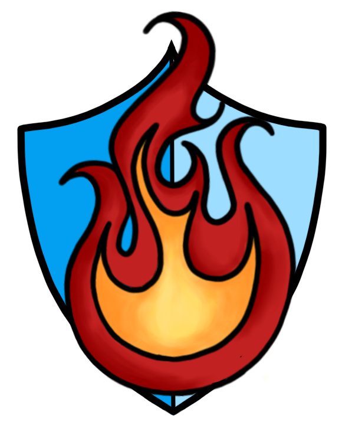

    

## Inspiration
Inspired by the numerous easily preventable deaths caused by the wildfires that have gone on this year due to climate change in areas like Canada and Hawaii and the drastic drop in air quality in areas like New York we set out to design a product to not only report and track the effects of climate change, but hopefully save some lives.

## What it does
We set out to design hardware components that can track temperature changes and air quality changes via microtrollers. These microcontrollers transfer their readings via serial ports to computers which then upload the data to Hedera's consensus service. Using this decentralized service we are able to quickly deliver crucial information to the public regarding the temperature and air qualities of Earth's most vulnerable climates. We also used NASA's LANDSAT Open API to help detect wildfire hotspots on Earth accurately based on a collection of intermediate algorithm quantities used in this detection process to help users gauge the quality of fire hotspots.

## How we built it
We used an Arduino Uno and an ESP8266 to gather sensor data. These microcontrollers transmitted their readings over serial ports to processes running Javascript that would publish this data to a topic on Hedera's consensus service - a "purpose-built tool for creating decentralized, auditable logs of immutable and timestamped events". To emulate how this service would be used in a real-world scenario, we wrote an additional Javascript program that read from the topic and would send data over serial to an additional Arduino Uno to act as a physical early warning system.
######

We also created a website using the Taipy Python web framework. This website allows the public to view all data collected from our sensors. The immutable and timestamped logs stored by Hedera's consensus service allowed us to provide data to this website. 
######

We then used Python with the receive library to receive NASA's LANDSAT API with the CSV library to properly read the files and the StringIO library to iterate over the dataset so that we could present the data to the folium library to create a map with markers of wildfires in the last 24 hours and updates in real-time.

######

Finally, our logo was designed using Procreate.

## Challenges we ran into
Our team struggled with using Taipy to create our website as the framework is relatively new and documentation surrounding the framework is sparse and unfinished.

## Accomplishments that we're proud of
We are super proud of our teamwork. Everyone comes from a variety of backgrounds from data visualization, to aerospace engineering, to computer science, and to information technology, but we were all able to stick to our strong suits and contribute heavily to our end goals. We are also extremely proud of the amount of work we were able to accomplish in a single weekend as we would end up completing three entirely separate microservices.

## What we learned
We learned that using APIS are surprisingly much easier to use than anticipated. We also developed our skills in web development, and we learned the importance of having a team with different backgrounds. 

## What's next for PyroGuard
We want to continue working on this project adding more data collection features so we can track wildfire hotspots, compare the amount of wildfires to previous years, and track the degradation of air quality. We also want to make it so that the website can notify user's phones when a potential natural disaster is close.